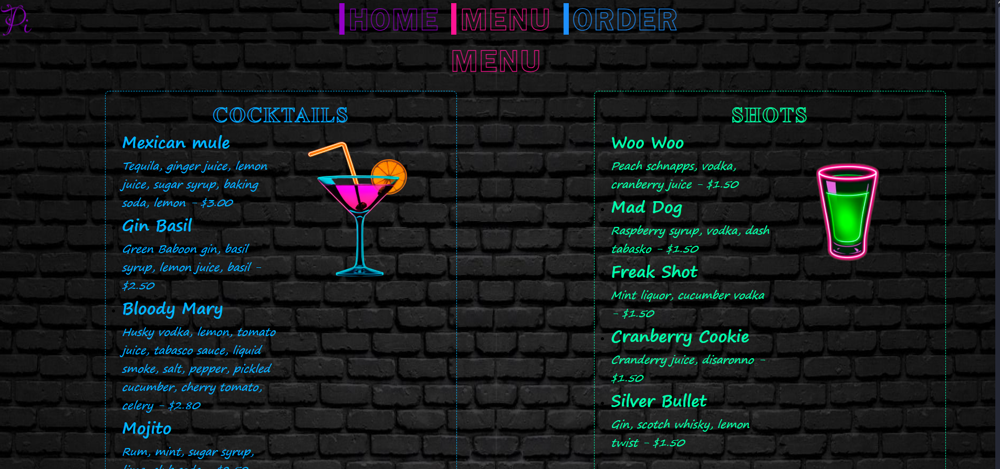

<h2 align="center">
  Pi menu - Bar Menu 
  <a href="https://pi-bar-menu.netlify.app" target="_blank">PiBar</a>
</h2>

  

 

Welcome to **Pi Bar**! This project is a simple bar menu with an order form. 
This project contains 2 pages bar_menu for menu and order form and order (./scr/order.html) for order receipt. The page styles are stored in ./scr/styles.css. Check generation is done with js and is stored in ./scr/script.js.Images used in the project are stored in ./scr/assets.

## Technologies used

- **HTML5**: For structuring content.
- **CSS3**: For styling the page and making it responsive.
- **Js**: For generating an order receipt.

## How to Use

1. Clone or download the repository to your local machine.
2. Open the `bar_menu.html` file in your web browser.
3. Browse the menu and fill out the order form.
